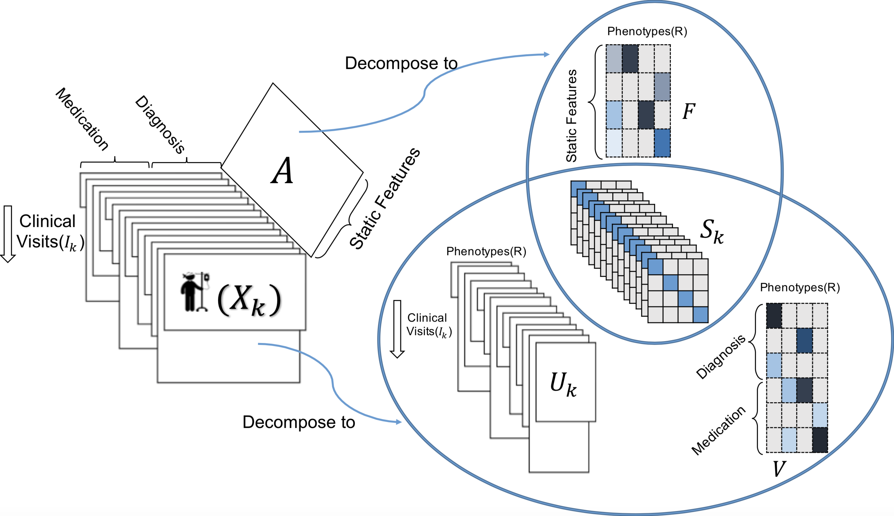

# TASTE
TASTE combines the PARAFAC2 model with non-negative matrix factorization to model a temporal and a static tensor. It performs two import tasks in healthcare: 1- computational phenotyping 2- Predictive modeling by analyzing electronic health records (EHRs). 

TASTE applied on dynamically-evolving structured EHR data and static patient information. Each  represents the medical features recorded for different clinical visits for patient .  Matrix  includes the static information (e.g., race, gender) of patients. TASTE decomposes  into three parts: , , and . Static matrix  is decomposed into two parts:  and . Note that  (personalized phenotype scores) is shared between static and dynamically-evolving features. 

## Relevant Publication
TASTE implements the code in the following paper:
